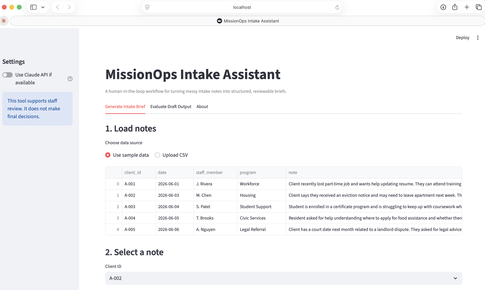
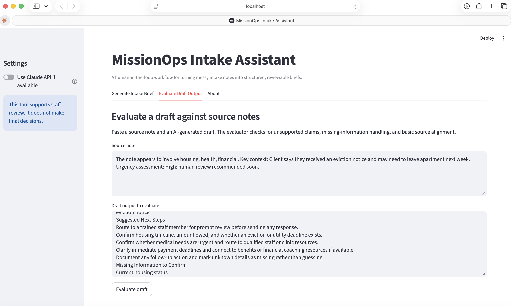
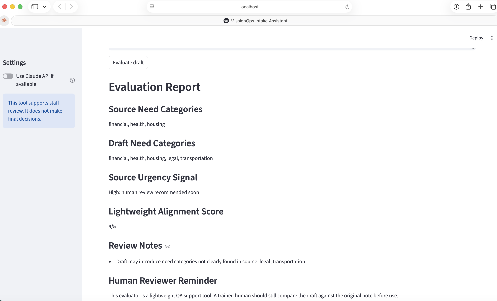

[README.md](https://github.com/user-attachments/files/29172093/README.md)
# MissionOps Intake Assistant

A lightweight, runnable AI workflow prototype for mission-driven organizations. It helps intake or program teams turn messy client notes into structured summaries, need categories, urgency flags, suggested next steps, missing-information checks, and a human-review checklist.

This repo is designed to show applied AI judgment, not just prompting. It includes a working Streamlit app, demo data, a rule-based fallback engine, optional Claude API support, and documentation for responsible handoff.

## Why this exists

Many nonprofits and public-interest teams work with unstructured notes from intake forms, calls, meetings, emails, and case updates. Important context can get buried, repeated, or missed. This prototype shows how AI-assisted workflows could help staff organize information faster while keeping humans in control.

## What it does

- Loads sample intake notes or a CSV upload
- Produces a structured intake brief
- Categorizes needs like housing, employment, food, transportation, education, health, and legal support
- Flags urgency based on explicit risk indicators
- Lists missing information to ask a human to confirm
- Pulls supporting snippets from the original note
- Generates a human review checklist
- Includes an evaluation tab for reviewing AI outputs against source notes
- Works without an API key using a deterministic rule-based engine
- Optionally calls the Claude API if `ANTHROPIC_API_KEY` is set

## What this does not do

This tool does not make eligibility decisions, legal decisions, medical decisions, housing determinations, or benefit determinations. It is a staff-support workflow that prepares a reviewable draft.

## Demo

Run locally:

```bash
git clone https://github.com/YOUR-USERNAME/missionops-intake-assistant.git
cd missionops-intake-assistant
python -m venv .venv
source .venv/bin/activate  # Windows: .venv\Scripts\activate
pip install -r requirements.txt
streamlit run app.py
```

Optional Claude API mode:

```bash
export ANTHROPIC_API_KEY="your-api-key"
streamlit run app.py
```

## CSV format

Your uploaded CSV should include at least:

```csv
client_id,note
```

Optional columns:

```csv
date,staff_member,program
```

See `sample_data/intake_notes.csv`.

## Repository structure

```text
.
├── app.py
├── requirements.txt
├── sample_data/
│   └── intake_notes.csv
├── src/
│   ├── triage_engine.py
│   ├── claude_client.py
│   └── evaluation.py
├── docs/
│   ├── problem-statement.md
│   ├── responsible-ai-notes.md
│   ├── handoff-guide.md
│   └── evaluation-rubric.md
└── tests/
    └── test_triage_engine.py
```

## Why this is relevant to Claude Corps

This project demonstrates:

- Applied AI workflow design
- Human-in-the-loop review
- Clear documentation and handoff
- Practical use for mission-driven organizations
- Judgment about what AI should and should not automate
- Ability to build something runnable and explainable

## Responsible AI principles

1. AI drafts, humans decide.
2. Source notes remain visible.
3. Missing information is labeled instead of guessed.
4. Urgency flags require human escalation.
5. Sensitive cases should be handled by trained staff.
6. The workflow should be adapted to each organization’s policies.

## Roadmap

- Add role-based staff views
- Add export to PDF or Google Docs
- Add redaction for sensitive information
- Add organization-specific resource directories
- Add structured evaluation logs
- Add deployment instructions for Streamlit Community Cloud

## Screenshots

### Homepage


### Intake Brief Generator


### Evaluation Report


### About Page

